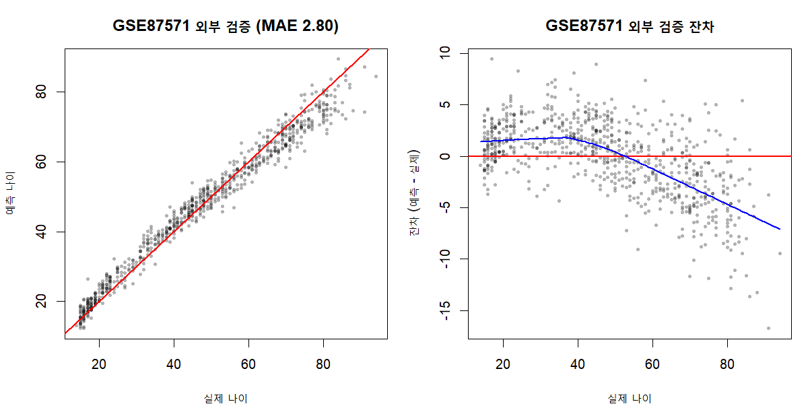
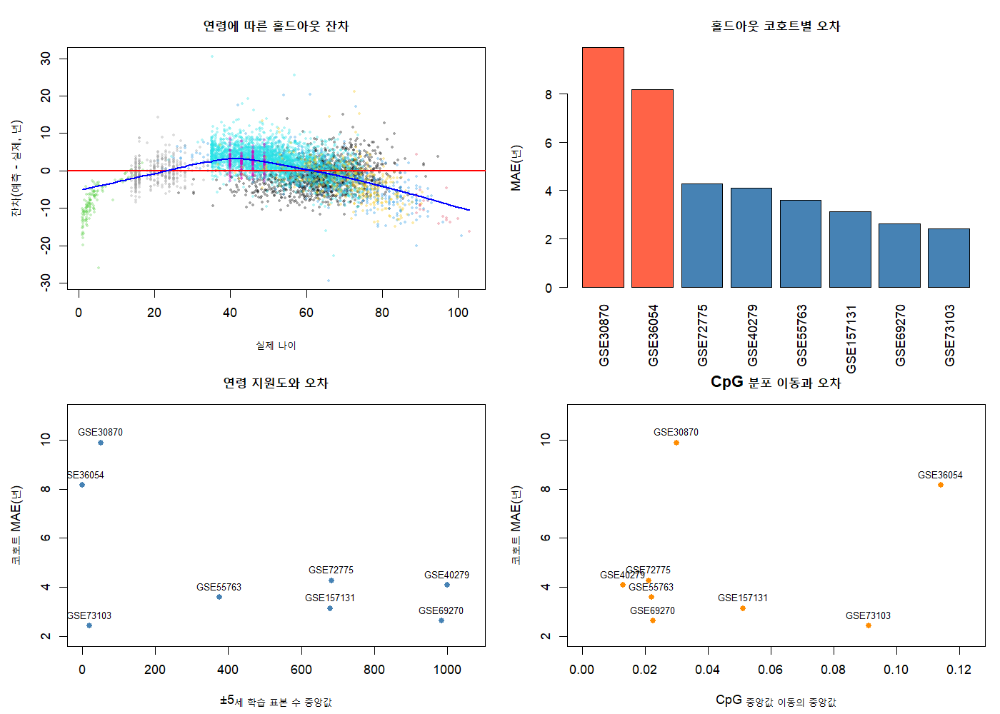

# DNA 메틸화 기반 연령 예측 (DNAm Age)

공개 혈액 DNA 메틸화 코호트 8개(5,541명, 공통 869 CpG)로 실제 연령을 예측하는 Elastic Net 모델을 학습하고, 학습에 전혀 사용하지 않은 별도 코호트에서 **잠금 외부 검증을 1회** 수행한 프로젝트입니다.

평균 정확도를 높이는 것보다 **코호트가 바뀌어도 성능이 유지되는지**, **연령 극단에서 어떻게 무너지는지**를 검증하는 데 초점을 맞췄습니다.

> 연구·교육용 분석입니다. 임상 진단이나 개인 건강 상태의 확정적 판단에 사용할 수 없습니다.

## 핵심 결과

| 평가 방식 | 데이터 | 표본 | MAE | RMSE | R² |
| --- | --- | ---: | ---: | ---: | ---: |
| **잠금 외부 검증** | GSE87571 (학습·튜닝 미사용) | 729 | **2.80년** | 3.62년 | 0.970 |
| 내부 중첩 교차검증 | 학습 8개 코호트 leave-one-cohort-out | 5,541 | 4.15년 | 5.18년 | 0.909 |



내부 교차검증 오차가 외부 검증보다 큰 것은 이상한 결과가 아닙니다. 내부 평가는 매 fold마다 코호트 하나를 통째로 홀드아웃해 **코호트 이동을 강제로 겪게 하는** 반면, GSE87571은 단일 코호트입니다. 두 수치를 함께 보고하는 이유이기도 합니다.

### 전체 MAE만 보면 안 되는 이유

| 연령 구간 | 표본 | MAE | 평균 잔차 |
| --- | ---: | ---: | ---: |
| < 20세 | 100 | 1.64년 | +0.99년 |
| 20–39세 | 169 | 2.61년 | +2.22년 |
| 40–59세 | 225 | 2.24년 | +0.71년 |
| 60–79세 | 186 | 3.39년 | −2.52년 |
| **≥ 80세** | 49 | **6.08년** | **−5.74년** |

R² 0.970이라는 숫자 뒤에 **고령층 과소예측**이 숨어 있습니다. 이 진단이 이후 작업의 출발점입니다.

## 이 프로젝트가 지킨 규칙

데이터 누수를 막기 위해 아래를 코드와 문서로 강제했습니다.

1. **행 단위 무작위 분할을 쓰지 않습니다.** 학습과 평가를 원 코호트 단위로 분리합니다(leave-one-cohort-out 중첩 교차검증).
2. **결측 대치·표준화·하이퍼파라미터 선택은 각 학습 fold 안에서만** 계산합니다.
3. **외부 데이터는 모델과 판정 기준을 잠근 뒤에만** 읽습니다. 외부 평가 스크립트는 결과 파일이 있으면 재실행을 차단하고, 재평가에는 명시적 사유를 요구합니다.
4. **한 번 평가에 쓴 외부 코호트는 새 후보 선택에 재사용하지 않습니다.**
5. **판정 기준을 결과보다 먼저 고정합니다.** 후보 모델 교체 조건 4개는 외부 데이터를 열기 전에 기계 판독 가능한 CSV로 잠갔습니다.
6. **반복측정과 가족 표본을 독립 표본으로 취급하지 않습니다.** 쌍둥이 코호트는 가족 cluster 단위 bootstrap으로 불확실성을 계산합니다.

주요 의사결정과 근거는 [ADR](docs/adr/README.md) 6건으로 남겼습니다.

## 진행 중: 고령층 편향 개선과 그 검증



편향 감사 결과 고령층 오차는 **학습 데이터의 연령 지원도 부족**과 관련이 있었습니다. 이에 연령 구간 역빈도 가중치(`age_density`)를 후보로 만들어 중첩 교차검증에서 비교했습니다.

| 가중치 | 내부 중첩 CV MAE |
| --- | ---: |
| standard (현행 잠금 모델) | 4.15년 |
| **age_density (후보)** | **3.78년** |
| mixed | 4.07년 |
| calibrated_standard | 4.46년 |

내부 성능은 개선됐지만 **아직 배포 모델이 아닙니다.** GSE87571은 이미 표준 모델 평가에 썼으므로, 새 고령층 코호트 SATSA(`S-BSST1206`)로 검증하기로 하고 교체 조건 4개를 사전에 잠갔습니다.

### 사전 품질 게이트에서 멈춘 지점

SATSA 원본 6.74GB를 스트리밍 추출한 결과, **모델이 쓰는 869개 CpG 중 610개(70.2%)만 존재**해 사전 기준 95%에 미달했습니다. SATSA 공개 행렬이 450K 전체가 아니라 자체 품질검사 뒤 남은 250,816 probe만 제공하기 때문입니다.

없는 259개는 후보 모델 비영 계수 377개 중 108개, **계수 절댓값 합의 26.4%**를 차지합니다. 학습 중앙값으로 대치하면 예측이 평균 쪽으로 수축해 고령층 검증이라는 목적 자체가 무효가 되므로, **기준을 낮추거나 누락 CpG를 대체하지 않고 평가를 중단했습니다.** 표준 모델을 교체하지 않는다는 경계는 그대로 유지됩니다.

판정표와 후속 계획은 [SATSA beta 스트리밍 추출과 품질 게이트](docs/satsa-beta-extraction.md)에 있습니다.

## 데이터

| 데이터 | 역할 | 모델 선택 사용 |
| --- | --- | --- |
| GSE207605에서 선별한 8개 코호트 (5,541명) | 학습·내부 검증 | 사용 |
| GSE87571 (729명) | 표준 모델의 잠금 외부 검증 | 사용하지 않음 |
| SATSA `S-BSST1206` (447명) | 후보 모델의 고령층 외부 검증 | 사용하지 않음 |

원천 데이터와 재생성 가능한 산출물은 Git에 포함하지 않고 URL·크기·해시와 생성 코드만 버전 관리합니다. 코호트별 포함·제외 근거는 `config/`의 CSV manifest에 있습니다.

## 파이프라인

`scripts/r/`의 번호 순서가 곧 실행 순서입니다.

| 스크립트 | 역할 |
| --- | --- |
| `0_check_r_environment.R` | 잠금 모델과 R·glmnet 버전 일치 확인 |
| `2_cohort_metadata_audit.R` | GEO 표본 메타데이터 경량 수집과 적합성 감사 |
| `6_audit_gse207605_training_pool.R` | 19개 구성 코호트 감사, include/conditional/exclude 판정 |
| `7_build_gse207605_training_bundle.R` | 5,541 × 869 학습 bundle 생성 |
| `8_train_grouped_elastic_net.R` | 코호트 그룹 기반 중첩 교차검증 |
| `10_lock_model_and_evaluate_gse87571.R` | 모델 잠금 후 외부 검증 1회 |
| `11_measure_training_learning_curve.R` | 표본 수가 병목인지 학습곡선으로 판정 |
| `12_audit_age_and_cohort_bias.R` | 연령 극단·취약 코호트 편향 진단 |
| `13_compare_age_bias_mitigation.R` | 가중치·보정 후보 중첩 CV 비교 |
| `14_lock_age_density_candidate.R` | 채택 후보를 학습 데이터만으로 잠금 |
| `15_prepare_satsa_external_manifest.R` | SATSA 표현형만 받아 447명 표본 잠금 |
| `16_prepare_satsa_external_bundle.R` | 6.74GB 스트리밍 추출과 품질 게이트 |
| `17_evaluate_satsa_locked_models.R` | 사전 기준 4개 판정과 가족 cluster bootstrap |

실행 명령과 옵션은 [scripts/r/README.md](scripts/r/README.md)에 있습니다. `scripts/r/legacy/`와 [notebooks/](notebooks/)는 초기 탐색 기록이며 현행 성능 재현에는 사용하지 않습니다.

## 재현 방법

### 환경

R 4.3.3과 `glmnet` 5.0을 사용했습니다. 잠금 모델을 직렬화한 버전과 일치해야 합니다.

```powershell
& "C:\Program Files\R\R-4.3.3\bin\Rscript.exe" scripts/r/0_check_r_environment.R
```

```r
install.packages(c("BiocManager", "glmnet", "readr", "progress"))
BiocManager::install(c("GEOquery", "impute"))
```

### 실행

대부분의 스크립트는 원천 데이터를 읽지 않고 설계만 확인하는 `--dry-run`을 제공합니다. 외부 검증처럼 되돌릴 수 없는 단계는 명시적 확인 인자를 요구합니다.

```powershell
& "C:\Program Files\R\R-4.3.3\bin\Rscript.exe" scripts/r/10_lock_model_and_evaluate_gse87571.R --dry-run
& "C:\Program Files\R\R-4.3.3\bin\Rscript.exe" scripts/r/10_lock_model_and_evaluate_gse87571.R --confirm-external-evaluation
```

데이터 획득 순서는 [data/README.md](data/README.md)와 `config/dataset_download_manifest.csv`를 참고하세요.

## 저장소 구조

```text
DNAage_clean/
├── config/                 # 코호트 정책, 다운로드 manifest, 사전 잠금 평가 기준
├── data/                   # 원천·처리 데이터 (Git 제외, 획득 방법만 문서화)
├── docs/
│   ├── adr/                # 기술·분석 의사결정 기록
│   └── figures/            # 저장소에 포함하는 결과 그림
├── notebooks/              # 초기 Python 탐색 분석
├── outputs/                # 재생성 가능한 지표·그림 (Git 제외)
├── scripts/
│   ├── ci/                 # 저장소·설정 CSV·R 구문 검증
│   └── r/                  # 번호 순서의 현행 파이프라인과 legacy/
└── .github/                # Issue·PR 양식과 CI
```

## 문서

- [프로젝트 개요](docs/PROJECT_OVERVIEW.md) — 목표, 현재 상태, 전체 분석 흐름
- [전체 문서 지도](docs/README.md)
- [최종 모델과 외부 검증](docs/final-model-and-external-validation.md)
- [학습 데이터 규모별 학습곡선](docs/learning-curve-analysis.md)
- [연령 극단과 취약 코호트 편향 감사](docs/age-cohort-bias-audit.md)
- [연령 편향 완화 후보 비교 실험](docs/age-bias-mitigation-experiment.md)
- [ADR 인덱스](docs/adr/README.md)

## 해석 경계

869개 CpG는 공개 재분석 자료에서 **이미 연령 연관성으로 선별된** CpG 집합의 교집합입니다. 따라서 이 결과는 해당 특징 집합을 사용한 혈액 기반 연령 예측의 외부 검증으로 해석해야 하며, 독립적인 CpG 발굴 성능으로 주장하지 않습니다.

## 개발 운영

개인 프로젝트이지만 Issue → 기능 브랜치 → Pull Request 흐름으로 변경 이력을 관리하며, PR마다 저장소·설정 CSV 검증과 R 구문 검사가 CI로 실행됩니다. 규칙은 [CONTRIBUTING.md](CONTRIBUTING.md)와 [GitHub 운영 가이드](docs/github-workflow.md)에 있습니다.

## 참고 자료

- Horvath, S. (2013). *DNA methylation age of human tissues and cell types*. Genome Biology, 14, R115.
- [SATSA (S-BSST1206), EMBL-EBI BioStudies](https://www.ebi.ac.uk/biostudies/studies/S-BSST1206)
